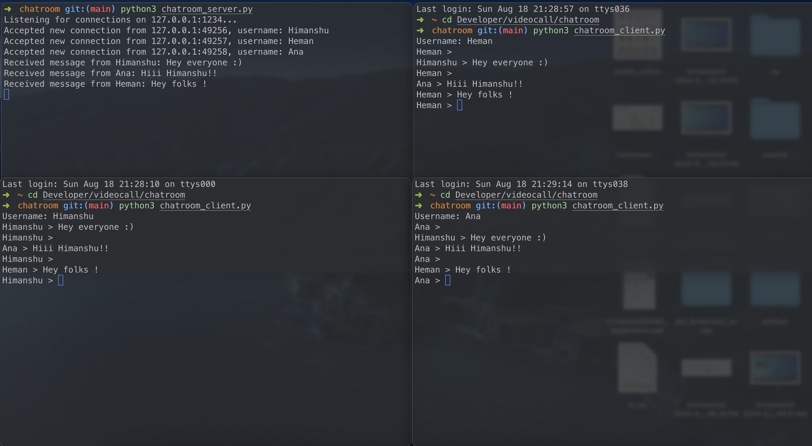

# Group Chatroom application using python sockets

## Purpose for the project
- Get to know more about the sockets and how does communication over lan takes place
- Because it's fun :)
- Vision: To make my own custom group chat app ( would be awesome right ! )

## Images

